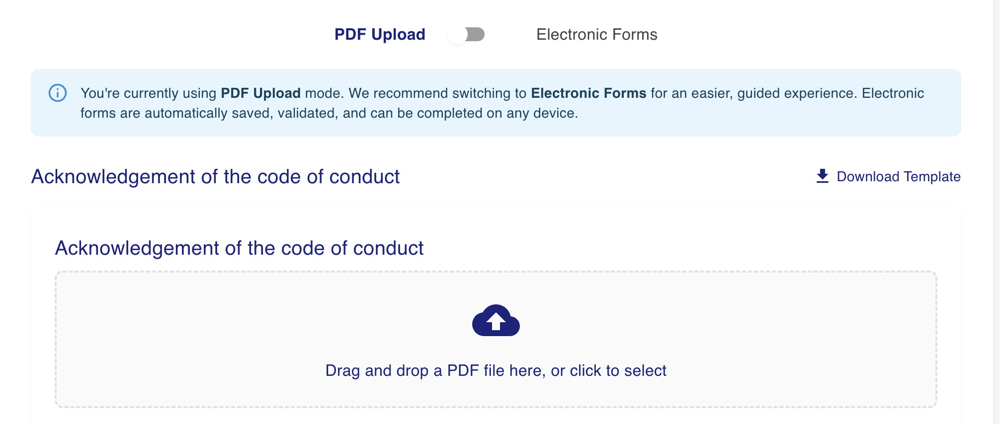

# Student Guide

### Introduction

Welcome to the site! This platform is designed to help students navigate their study abroad opportunities effectively.

### Getting Started

1. **Registration**:
   * Visit the registration page.
   * Fill in the required details and submit the form.
2. **Logging In**:
   * Use your registered email and password to log in.

### Navigating the Site

* The homepage provides quick links to various sections.
*

    <figure><figcaption></figcaption></figure>
* Use the navigation bar to access different features.
* Click Browse Programs to see active study abroad programs that you can apply to

### Using the Program Browser

* **Search for Programs**:
  * Utilize the search bar to find specific programs or information.
  *

      <figure><figcaption></figcaption></figure>
* **Submit Applications**:
  * Fill out the online application form and upload required documents.

### My Programs

Visit the My Programs tab to see your application status

<figure><figcaption></figcaption></figure>

## Electronic Form Submission

A student applies to a program, gets letter of recs and waits for approval. After approval they must submit documents.

They can either fill out a electronic form or fill out and upload a pdf template.\
\

<figure><figcaption></figcaption></figure>

complete the questions and clikcing submit will create a pdf and upload it to the secure file system.&#x20;
